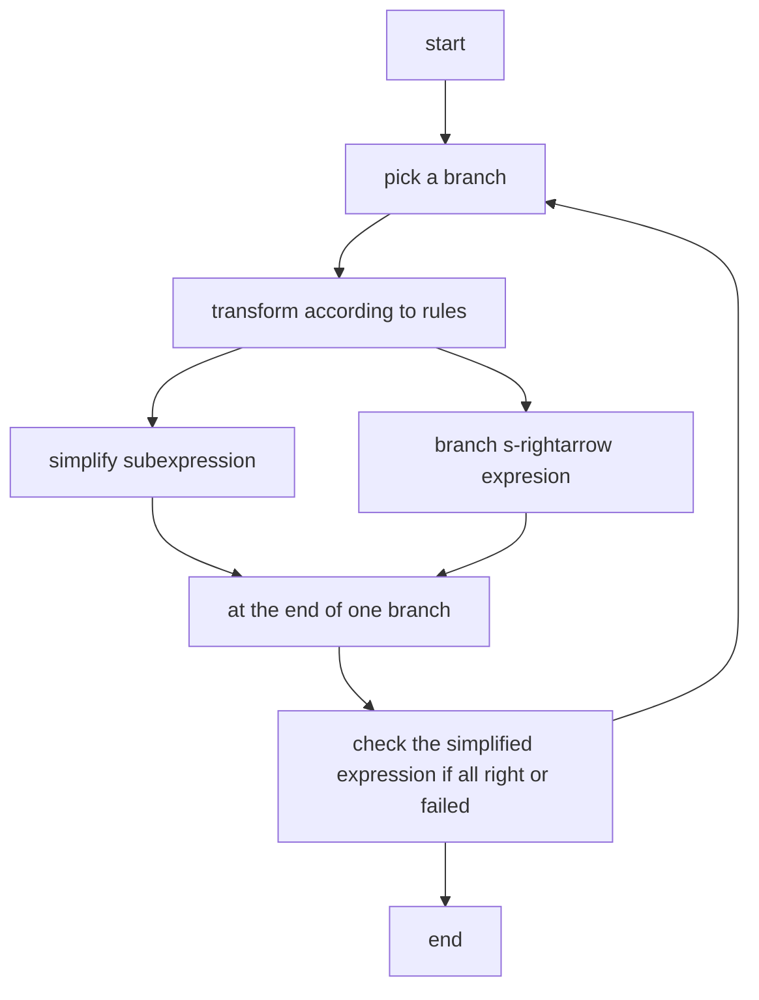

# report 
by 王德宇 2024013267
## 1.introduction
This is a report for my lisp implementation "WowHow" for "王浩算法".  
It is designed to be an interactive environment for testing logic. 
## 2.usage
### 2.1. Installation
using any lisp interpreter to load the file "wowhow.lisp"  
take sbcl for example:  
```shell
sbcl --load wowhow.lisp
```
### 2.2. Commands
* to define a symbol as a variable:
    ```lisp
    (declvar P)
    ```
* to check a statement:
    ```lisp
    (check `(s-rightarrow <left> <right>))
    ```
    which will return all right or failed.
    where `<left>` and `<right>` are expressions.
### 2.3. Syntax
* $P s\Rightarrow Q$  
    ```lisp
    (s-rightarrow P Q)
    ```
* $P \lor Q$  
    ```lisp
    (lor P Q)
    ```
* $P \land Q$  
    ```lisp
    (land P Q)
    ```
* $\neg P$  
    ```lisp
    (neg P)
    ```
* $P \rightarrow Q$  
    ```lisp
    (rightarrow P Q)
    ```
* $P \leftrightarrow Q$  
    ```lisp
    (leftrightarrow P Q)
    ```
### 2.4. Example
$(P \lor Q) \Rightarrow (Q \lor P)$
```lisp
(declvar P)
(declvar Q)
(check `(s-rightarrow (lor P Q) (lor Q P)))
```
returns:
```
passed: #(0 0 -1 2 1)
passed: #(0 0 -2 2 1)
all right
```
## 3. Implementation
### 3.1. Overview:

### 3.2. Difficulties:
1. invoke functions from father to child to determine the pos (left or right) of a expression.  
solution: use lambda to reverse the order of invoking. each exporession is wrapped by two lambda : operation lambda and construct lambda.
2. operate the expression   
solution: transfer the context (to move the sub expression) and contexts (to branch a new s-rightarrow expression) via lambda.
### 3.3. Details:

#### 3.3.1 framework
* main loop
```lisp
(defun check (exp)
    (let ((contexts (make-array 0  :fill-pointer 0 :adjustable t )))
      (vector-push-extend (make-array 0  :fill-pointer 0 :adjustable t ) contexts )
      (funcall (eval exp ) (elt contexts 0))
      ;invoke the construct lambda of s-rightarrow expression to init.
      (dovector (i contexts)
        ;multiple branches is saved in a outer loop
        (let (ret(context (elt contexts i))(flag (make-array (1+ *var-index*) :fill-pointer 0)))
          (dotimes (j (1+ *var-index*)) (vector-push  (vector 0 0) flag))
          (dovector  (j context)
            (let ((func (elt context j)))
            ;travel the sub expressions
            (setf ret (if (typep func 'function )
                        (progn
                          (setf  (elt context j) 0)i;set the pos to 0 in case of infinite branch
                          (setf (elt context j)   (funcall func  context contexts)))
                        ;this is the main point. the operation lambda invoked here did these:
                        ;1.judge  : according his pos and rule, invoke the construct lambda (form left and right) get two operation lambda
                        ;2.insert : insert the two operation lambda to the current context  or even a branch context
                        ;3.return : if the sub expression is a variable, return the unique code of the variable if a lambda return 0, all this is for check later
                        func )))
            (incf (elt(elt flag (abs ret)) (if (> ret 0) 0 1))))
          (if (= 1 (count-if (lambda (x) (= 1 (min (elt x 0) (elt x 1))))   flag :start 1));check part :determine if there is some  only same variable between left and right
              (progn
                (format t "passed: ~S ~&" context)
                (progn (format t "failed: ~S ~&" context) (return-from check )))))) 
            (format t "passed: ~S ~&" context)
            (progn (format t "failed: ~S ~&" context) (return-from check ))))))
  (format t "all right~&"))
```
* construct lambda of s-rightarrow 
```lisp
(defun s-rightarrow(left right)
    (lambda (context)
      (vector-push-extend (funcall left -1 ) context )
      (vector-push-extend (funcall right 1 ) context )))
```
* dynamic travel a vector to allow insert
```lisp
(defmacro dovector ((index vector)  &body body)
  `(do ((,index  0 (1+ ,index)))
       ((>= ,index  (length ,vector)))
     ,@body ))
```
#### 3.3.2 macro for define rules
1. base for defining rules: delay the invoking.
```lisp
(defmacro with-delay ( &key at-left at-left1 at-right at-right1)
  `(lambda (lr)
     (lambda (context contexts)
        (if  (= lr -1) (progn ,at-left1 ,at-left)
                        (progn ,at-right1 ,at-right) ))))
```
2. abstact the operation
```lisp
(defmacro push-to-context ( v1 lr1 &optional v2 lr2 )
  (if (eq lr2 nil)
      `(progn (vector-push-extend (funcall  ,v1 ,lr1)  context ) 0 )
      `(progn (vector-push-extend (funcall  ,v1 ,lr1)  context )  (vector-push-extend (funcall  ,v2 ,lr2)  context ) 0)))
(defmacro push-to-branch ( v1 lr1 &optional  v2 lr2 )
   `(progn (let* ((len (length context))(branch (make-array len  :fill-pointer len  :adjustable t)))
                (dotimes (i len)
                  (setf (elt branch i) (elt context i)))
                  ,@(if (eq lr2 nil)
                    `((vector-push-extend (funcall  ,v1 ,lr1)  branch) )
                    `((vector-push-extend (funcall  ,v1 ,lr1)   branch) (vector-push-extend (funcall  ,v2 ,lr2)   branch)))
                (vector-push-extend branch contexts ))
           0))
```
3. compose 1 and 2
```lisp
(defun  neg (left)
  (with-delay
   :at-left (push-to-context left 1 ):at-right (push-to-context left -1)))
(defun lor (left right)
  (with-delay
    :at-left (push-to-context left -1):at-left1 (push-to-branch right -1):at-right (push-to-context left 1 right 1)))
(defun land (left right)
  (with-delay
    :at-left (push-to-context left -1 right -1):at-right (push-to-context left 1):at-right1 (push-to-branch right 1)))
(defun rightarrow (left right)
  (with-delay
    :at-left (push-to-context right -1):at-left1 (push-to-branch left 1):at-right (push-to-context left -1 right 1)))
(defun leftrightarrow (left right )
  (with-delay :at-left (push-to-context left -1 right -1):at-right (push-to-branch left 1 right 1)))
```
